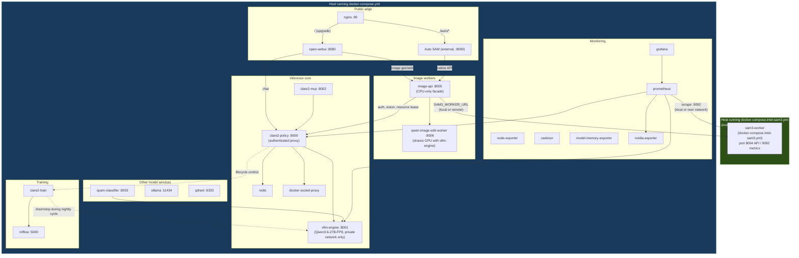

# Architecture: Server Boundaries and Container Topology

This stack does not have to run on a single machine. `sam3-worker` is the one
service explicitly designed to be split onto its own host, and the rest of
the stack (vLLM, CLARE₂, image workers, monitoring, the web edge) is designed
to run together on a second host. Confusing the two compose files, or trying
to bring up "just SAM3" from the main `docker-compose.yml`, is the most
common source of surprise (e.g. `docker compose up sam3-worker image-api`
pulling in `vllm-engine` because of `depends_on` chains). This document
explains the split and how to place services deliberately.

## The general shape: one system can run SAM3, another can run everything else

There are two compose files:

| Compose file | What it runs | Typical GPU |
|---|---|---|
| `docker-compose.yml` | Everything except SAM3: vLLM, CLARE₂ policy/training, image workers, monitoring, the web edge | Any NVIDIA GPU with enough unified/VRAM headroom (this repo's reference deployment uses an NVIDIA GB10) |
| `docker-compose.intel-sam3.yml` | `sam3-worker` only | Any GPU SAM3 supports (this repo's reference deployment uses an Intel Arc B580); `sam3/Dockerfile` also supports running it as part of the main compose file on the same NVIDIA GPU instead |

The two are joined by a single environment variable, set wherever the main
stack runs:

```bash
SAM3_WORKER_URL=http://<sam3-host>:8004
```

- **Non-empty:** the main stack treats SAM3 as remote. `start.sh` stops any
  local `sam3-worker` and starts the rest of the stack without the `sam3`
  profile; `image-api` calls the URL directly.
- **Empty:** the main stack runs SAM3 itself, locally, using the `sam3`
  profile on whatever GPU is present (`start.sh` auto-selects the GB10 or
  Intel Arc Dockerfile based on what hardware it detects).

This is an either/or switch, not a fallback — never run a local
`sam3-worker` at the same time as a remote one pointed at by
`SAM3_WORKER_URL`.

Any other service in `docker-compose.yml` could, in principle, be split onto
its own host the same way (point a `*_URL`/`*_HOST` variable at a remote
address instead of running the container locally). In practice SAM3 is the
one that ships with first-class support for this today, because it was the
first workload pulled off the shared GPU to fix a memory-contention lockup
(see `README.md`).

## Example split currently in use

The current deployment example splits like this:

| Host | Role | Compose file | GPU |
| --- | --- | --- | --- |
| **`system-A-dns`** | Everything except SAM3 | `docker-compose.yml` | NVIDIA GB10 (unified memory) |
| **`system-B-dns`** | SAM3 worker only | `docker-compose.intel-sam3.yml` | Intel Arc B580 |

`system-A-dns`'s `.env` sets:

```bash
SAM3_WORKER_URL=http://system-B-dns:8004
```

so `system-B-dns` runs nothing from the main stack — only `sam3-worker` on
its Arc B580. This is just one valid placement, not a hard requirement: the
same mechanism would let SAM3 run on the same host as everything else (unset
`SAM3_WORKER_URL`, use the local `sam3` profile), or on a third host, or on
any other GPU-bearing machine reachable over the network from wherever
`image-api` runs.

## What runs in `docker-compose.intel-sam3.yml`

Only one service, gated behind the `sam3` Compose profile:

```
sam3-worker (profile: sam3)
  build: sam3/Dockerfile.intel
  device: /dev/dri/renderD128 (Intel Arc B580, in this example)
  SAM3_PLATFORM=intel_arc, fp16 weights
  ports: 127.0.0.1:8004 (API), 127.0.0.1:9092 (metrics) — bind to 0.0.0.0
         only when SAM3_BIND_ADDRESS=0.0.0.0 is set, i.e. when another host
         needs to reach it over the network
```

It has no `depends_on` and no dependency on `vllm-engine`, `redis`,
`clare2-policy`, or anything else — that's what makes it safe to place on any
host independent of the rest of the stack. Bring it up on its own host with:

```bash
SAM3_INTEL_DEVICE_GID=$(stat --format %g /dev/dri/renderD128) \
SAM3_BIND_ADDRESS=0.0.0.0 \
./start.sh
```

`start.sh` picks `docker-compose.intel-sam3.yml` automatically when
`SAM3_PLATFORM` is `intel`/`intel_arc`/`b580`/`xpu`, or when an Intel render
device and its group ID are present, without needing `SAM3_WORKER_URL` set
locally (that variable belongs in the *main* stack's `.env`, wherever it
runs, not in the SAM3-only host's).

## What runs in `docker-compose.yml`

Everything except SAM3. Grouped by role:

- **Inference core:** `vllm-engine` (serves `Qwen/Qwen3.6-27B-FP8`),
  `clare2-policy` (authenticated proxy in front of it), `clare2-mcp`,
  `redis`, `docker-socket-proxy`.
- **Image workers:** `qwen-image-edit-worker` (shares the GPU with
  `vllm-engine`), `image-api` (CPU-only facade; calls SAM3 — local or remote,
  via `SAM3_WORKER_URL` — and the local `qwen-image-edit-worker` directly).
- **Training:** `clare2-train`, `mlflow`.
- **Other model services:** `spam-classifier` (rides on `vllm-engine`),
  `ollama`, `qdrant`.
- **Web/edge:** `open-webui`, `nginx` (public edge; proxies to
  `AUTO_SAM_UPSTREAM_HOST`/`OPEN_WEBUI_UPSTREAM_HOST` — in the current
  example both point back at `system-A-dns` itself, plus an external
  "Auto SAM" service on port 8090 that is not part of this repo's compose
  files).
- **Monitoring:** `prometheus`, `grafana`, `node-exporter`, `cadvisor`,
  `model-memory-exporter`, `nvidia-exporter`. Prometheus scrapes whichever
  `sam3-worker` is active, local or remote, over the network.

`image-api`'s `depends_on: clare2-policy` (which itself `depends_on:
vllm-engine`) is why targeting `image-api` alone still pulls in the whole
inference core, wherever the main stack runs — there is no way around that
dependency chain, by design: `image-api` needs the policy proxy for auth,
vision-model calls, and the optional exclusive-vLLM resource lease. This is
unrelated to where SAM3 is placed.

## Diagram

The diagram below shows the current example split (SAM3 on one host, the
rest of the stack on another). The dashed boundary is the one that moves:
`sam3-worker` could just as easily be inside the same box as everything else,
with `SAM3_WORKER_URL` unset.



## Key takeaways

1. **The split is a deployment choice, not a fixed topology.** SAM3 can run
   on the same host as the rest of the stack, or on a separate host with its
   own GPU — `SAM3_WORKER_URL` (set or empty) is the only thing that decides
   which. Any host names used above are one example, not a requirement.
2. **`docker-compose.yml` runs everything except SAM3; `docker-compose.intel-sam3.yml`
   runs only SAM3.** Never run `sam3-worker` from both at once — `start.sh`
   enforces the either/or based on `SAM3_WORKER_URL`.
3. **`image-api` always drags in the inference core** wherever the main
   stack runs, because of its `depends_on` chain through `clare2-policy` →
   `vllm-engine`. This is unrelated to SAM3 and happens regardless of where
   SAM3 itself is placed.
4. **`sam3-worker` is standalone** — no `depends_on`, no CLARE₂, no vLLM. It
   only needs the Hugging Face token secret and a supported GPU, which is
   what makes it safe to place on any host.
